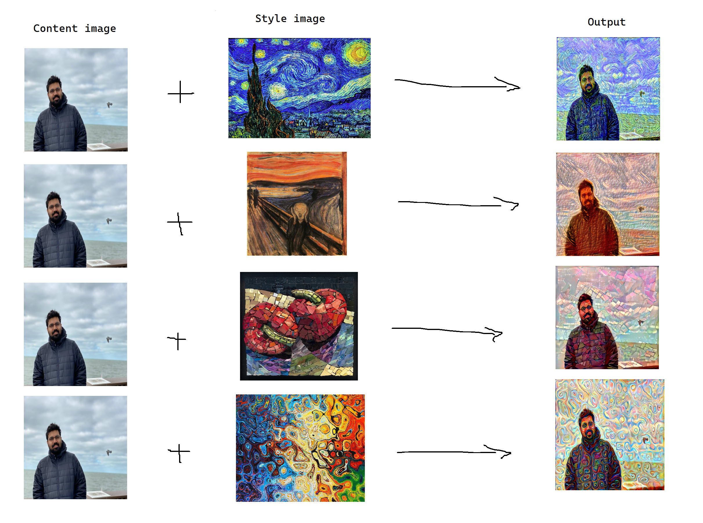
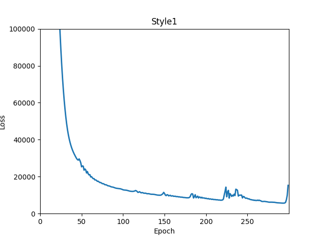
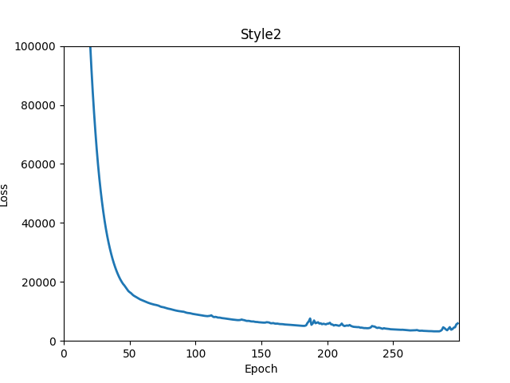
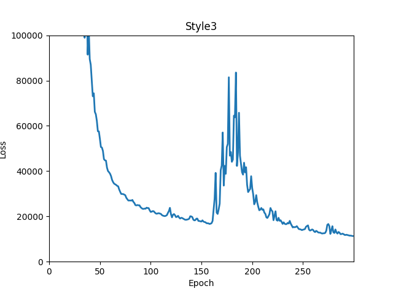
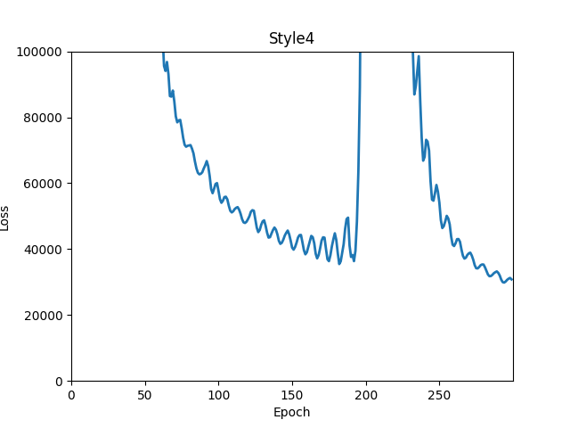

# Project-group-19
The goal of Image Style Transfer is to take an input of two images, one for style and another for
content. The style image represents the texture, colors and curvatures, while the content image
represents the higher level objects and how they are arranged. The output is a combination of both
the style image and the content image. 

## Setup
1. This project was made with torch==1.9.0 and torchvision==0.10.0+cu111 with Python 3.9.12
2. Git clone this repo, or put main.py into a folder where there is also an 'Output' folder and a 'data' folder. The output folder must contain three subfolders: 'random', 'cifar10', and 'cifar100', otherwise the code will not run.
4. Run the following commands in an elevated CMD prompt. If 'python3' doesnt work then try 'python'.

    _python3 -m pip install --upgrade pip_
    
    _python3 -m pip install --upgrade Pillow_
    
    _pip install torch torchvision matplotlib numpy PIL_
    

## Run
To perfrom style transfer on cifar-10 dataset, run the following command

    python main.py cifar10 style-image-name

To perfrom style transfer on cifar-100 dataset, run the following command

    python main.py cifar100 style-image-name

To perfrom style transfer on random image, run the following command

     python main.py random input-image-name style-image-name
  
All the output will be generated in output folder

To tune the style, add another parameter style-level and run the command

    python main.py random input-image-name style-image-name style-level 1

    python main.py random input-image-name style-image-name style-level 2

    python main.py random input-image-name style-image-name style-level 3

Style-level 1, 2 and 3 are three levels of stylization where increasing this value creates a more stylized output.

## Results
- Example result: trained on style-level 2, four styles tested on the same image with the same setup.

- Performance on each style: total loss over time

| Style 1  | Style 2 | Style 3  | Style 4 |
| ------------- | ------------- | ------------- | ------------- |
|   |   |   |   |

## References
- https://www.tensorflow.org/hub/tutorials/tf2_arbitrary_image_stylization
- Gatys, Leon A., Alexander S. Ecker, and Matthias Bethge. “Image style transfer using
convolutional neural networks.” Proceedings of the IEEE conference on computer vision and
pattern recognition. 2016. https://arxiv.org/abs/1508.06576
- Selim, Elgharib, M., & Doyle, L. (2016). Painting style transfer for head portraits using
convolutional neural networks. ACM Transactions on Graphics, 35(4), 1–18. https://dl.acm.org/doi/10.1145/2897824.2925968
